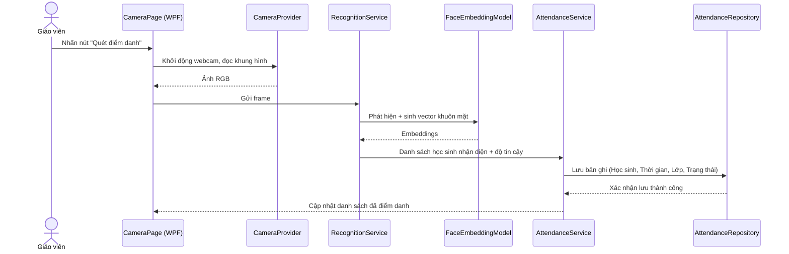
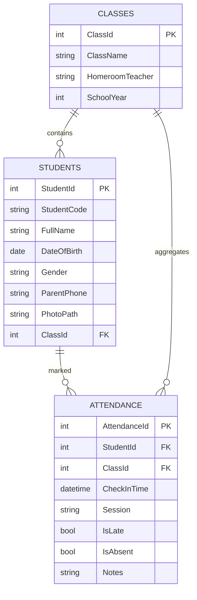

# Kiến trúc hệ thống điểm danh (Visual Studio)

## Tổng quan

Giải pháp được triển khai dưới dạng ứng dụng **.NET 7** (C#) xây dựng trong Visual Studio. Ứng dụng máy trạm chạy trên máy tính lớp học, kết nối webcam để quét khuôn mặt, nhận diện học sinh theo thời gian thực và tự động ghi dữ liệu điểm danh vào cơ sở dữ liệu nội bộ. Giáo viên chủ nhiệm có thể xem thống kê vắng mặt/chuyên cần theo tháng, quản lý hồ sơ học sinh, lớp học và xuất báo cáo. Ứng dụng hỗ trợ đồng bộ dữ liệu lên máy chủ (tùy chọn) thông qua REST API nếu nhà trường có hạ tầng trung tâm.

## Kiến trúc lớp & mô-đun

```mermaid
flowchart TD
    subgraph Presentation Layer (WPF UI)
        Dashboard[Attendance Dashboard]
        ClassManager[Class & Student Manager]
        ReportView[Monthly Report View]
        CameraPage[Camera Capture Page]
    end

    subgraph Application Layer
        AttendanceService[AttendanceService]
        RecognitionService[RecognitionService]
        ReportService[ReportService]
        ClassService[ClassService]
        SyncService[SyncService (optional)]
    end

    subgraph Infrastructure Layer
        CameraProvider[CameraProvider (OpenCV/MediaPipe)]
        FaceModel[FaceEmbeddingModel]
        AttendanceRepo[AttendanceRepository]
        StudentRepo[StudentRepository]
        ClassRepo[ClassRepository]
        DbContext[SQLite DbContext]
        FileStorage[ImageDatasetStorage]
        HttpClient[REST API Client]
    end

    CameraPage --> AttendanceService
    AttendanceService --> RecognitionService
    RecognitionService --> CameraProvider
    RecognitionService --> FaceModel
    AttendanceService --> AttendanceRepo
    AttendanceRepo --> DbContext
    ClassManager --> ClassService
    ClassService --> ClassRepo
    ClassRepo --> DbContext
    ClassManager --> StudentRepo
    StudentRepo --> DbContext
    ReportView --> ReportService
    ReportService --> AttendanceRepo
    ReportService --> ClassRepo
    SyncService --> HttpClient
    SyncService --> AttendanceRepo
    SyncService --> ClassRepo
    FileStorage --> RecognitionService
```

### Trình tự xử lý điểm danh



## Cơ sở dữ liệu

Ứng dụng sử dụng **SQLite** cho bản demo; có thể thay thế bằng SQL Server Express nếu cần tích hợp Active Directory. Sơ đồ ER đề xuất:



### Lớp truy cập dữ liệu (Repository)

- `AttendanceRepository`: truy vấn điểm danh theo ngày/tháng, tính số lần vắng, chuyên cần.
- `StudentRepository`: CRUD học sinh, lưu đường dẫn ảnh mẫu, khóa ngoại lớp học.
- `ClassRepository`: quản lý danh sách lớp, phân công GVCN, năm học.
- `FaceTemplateRepository` (tùy chọn): lưu embedding đã trích xuất cho mỗi học sinh để tăng tốc nhận diện.

## Luồng báo cáo chuyên cần

```mermaid
flowchart LR
    AttendanceRepo --> Calc[ReportService.CalculateMonthlySummary()]
    ClassRepo --> Calc
    Calc --> Sheets[Dataset (DataTable)]
    Sheets --> ReportView
    Sheets --> ExportCSV[Export CSV/Excel]
    Sheets --> ExportPDF[Export PDF]
```

`ReportService` cung cấp các phương thức:

- `GetMonthlyAttendance(classId, month)`: trả về danh sách học sinh, tổng số buổi có mặt, vắng, đi muộn.
- `GetAbsenceHeatmap(studentId, year)`: dữ liệu để hiển thị lịch nhiệt độ vắng mặt.
- `GenerateSummaryReport(month)`: tạo file Excel/PDF (sử dụng `ClosedXML` hoặc `Syncfusion`).

## Thành phần nhận diện khuôn mặt

- **CameraProvider**: sử dụng `OpenCvSharp4` hoặc `Emgu CV` để truy cập webcam, trả về `Mat`/`BitmapSource`.
- **FaceEmbeddingModel**: gọi model đã huấn luyện (ví dụ: `onnxruntime` với model `ArcFace`/`FaceNet`). Module này triển khai pattern `IFaceRecognizer` để dễ thay thế model.
- **RecognitionService**:
  - Phát hiện khuôn mặt: MTCNN/MediaPipe Face Detection chạy qua ONNX Runtime.
  - Chuẩn hóa ảnh, sinh embedding, so khớp với cơ sở dữ liệu (KD-tree hoặc cosine similarity).
  - Áp dụng ngưỡng tin cậy, trả về `RecognizedStudent` gồm `StudentId`, `Name`, `Confidence`.

## Trải nghiệm người dùng (WPF)

- **Dashboard**: hiển thị số học sinh vắng hôm nay, biểu đồ chuyên cần theo tháng, top học sinh đi muộn.
- **CameraPage**: panel hiển thị webcam, danh sách học sinh đã điểm danh trong tiết học, nút xác nhận kết thúc buổi học.
- **ClassManager**: form quản lý lớp, danh sách học sinh, import từ Excel, chụp ảnh mẫu trực tiếp.
- **ReportView**: bộ lọc tháng/lớp, bảng tổng hợp, nút xuất báo cáo.

## Cấu trúc Solution trong Visual Studio

```
FaceAttendance.sln
├── FaceAttendance.App            # WPF UI
├── FaceAttendance.Application    # Services, DTO, UseCases
├── FaceAttendance.Domain         # Entity, Interface
├── FaceAttendance.Infrastructure # EF Core, Repositories, ML models
├── FaceAttendance.Tests          # xUnit/NUnit tests
└── FaceAttendance.Worker         # (tùy chọn) dịch vụ nền đồng bộ cloud
```

## Quy trình triển khai

1. **Huấn luyện/đăng ký khuôn mặt**: tạo công cụ trong ứng dụng để chụp nhiều ảnh/nhập ảnh mẫu, trích xuất embedding và lưu vào bảng `FaceTemplates`.
2. **Điểm danh theo tiết học**: Giáo viên mở CameraPage, chọn lớp, hệ thống tự động ghi lại bản ghi điểm danh khi nhận diện thành công.
3. **Đồng bộ & sao lưu**: cấu hình SyncService gửi dữ liệu về server trung tâm định kỳ, hoặc sao lưu SQLite lên OneDrive.
4. **Báo cáo hàng tháng**: ReportService tổng hợp dữ liệu, hiển thị biểu đồ và cho phép xuất file.

## Bảo mật & quyền riêng tư

- Mã hóa cơ sở dữ liệu SQLite bằng `System.Data.SQLite` với password.
- Che mờ/ẩn danh nếu học sinh không cho phép lưu ảnh.
- Cho phép đặt ngưỡng tin cậy và yêu cầu xác nhận bằng tay khi confidence thấp.
- Ghi log truy cập, phân quyền tài khoản (Admin, Giáo viên, Giám thị) thông qua `Microsoft.Identity`.
